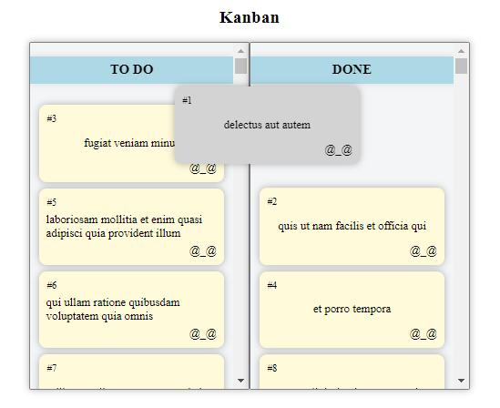
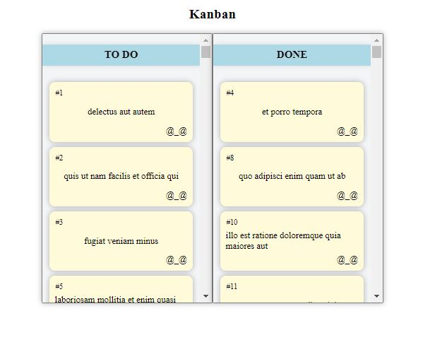

# Kanban React App



Welcome to the Kanban React App! This application is a simple Kanban board that allows you to manage tasks by organizing them into "To-Do" and "Completed" columns using drag-and-drop functionality.

## Live Demo

Check out the live demo: [Kanban React App](https://kanban-react-app-rosy.vercel.app/)

## Features

- **Drag-and-Drop:** Easily move tasks between "To-Do" and "Completed" columns using `react-beautiful-dnd`.
- **Stylish UI:** Styled with `styled-components` for an appealing and user-friendly interface.

## Getting Started

Follow these steps to clone and run the Kanban React App locally:

1. Clone the repository:

    ```bash
    git clone https://github.com/Geek24YT/Kanban-React-App
    ```

2. Navigate to the project folder:

    ```bash
    cd kanban-react-app
    ```

3. Install dependencies:

    ```bash
    npm install
    ```

4. Start the app:

    ```bash
    npm run dev
    ```

    The app will be accessible at `http://localhost:5173/` in your browser.

## Screenshots




## Contributing

Contributions are welcome! Feel free to open issues or submit pull requests.

## License

This project is licensed under the MIT License - see the [LICENSE](LICENSE) file for details.

